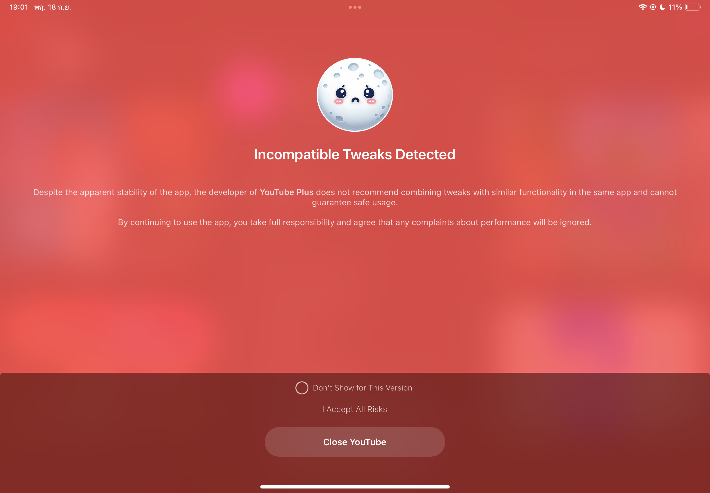

# YTLitePlusEXTRA
This is a fork repo from YTLite,but add more tweaks similar to YTLitePlus.
This is just an another alternative for who can't build IPA in YTLitePlus or The app is unusable.
If you have any problems,feel free to open issues.
Also if you see a popup says "Incompatible Tweaks Detected" like this:

Just check on "Don't show for this version",click on "I accept all risks" and ignore it.

## Main Features
- YTLite (eg. Download Videos,No ads,Background Playback)
- NoYTPremium (Remove Premium alerts)
- YouMute (Mute the video sounds in video overlay)
- YouSpeed (Change video speeds in video overlay)
- YTABConfig (Configures A/B settings)
- YTDarker (Enable native darker dark mode)
- YouTimeStamp (Copy video URL from video overlay)
- YouSlider (Customizes iOS YouTube video slider and scrubber)
- And Much more...

## FAQ
- [🇺🇸 English FAQ](FAQs/FAQ_EN.md)

## How to build a YTLitePlusEXTRA IPA using Github actions
> [!NOTE]
> If this your first time, complete following steps before starting:
>
> 1. Fork this repository using the fork button on the top right
> 2. On your forked repository, go to **Repository Settings** > **Actions**, enable **Read and Write** permissions.

  
How to build the YTLitePlusEXTRA IPA

  <ol>
    <li>Click on <strong>Sync fork</strong>, and if your branch is out-of-date, click on <strong>Update branch</strong>.</li>
    <li>Navigate to the <strong>Actions tab</strong> in your forked repository and select <strong>Build YTLitePlusEXTRA IPA. (Make sure you choose For Sideloading or Not For Sideloading workflow for your target device)</strong></li>
    <li>Click the <strong>Run workflow</strong> button located on the right side.</li>
    <li>Prepare a decrypted .ipa file <em>(I cannot provide this due to legal reasons)</em>, then upload it to a file provider (e.g., filebin.net, filemail.com, or Dropbox is recommended). Paste the URL of the decrypted IPA file in the provided field.</li>
    <li><strong>NOTE:</strong> Make sure to provide a direct download link to the file, not a link to a webpage. Otherwise, the process will fail.</li>
    <li>Enter the tweak version from the releases (the latest release is selected by default). You can also change the BundleID and Display Name if desired.</li>
    <li>Make sure all inputs are correct, then click <strong>Run workflow</strong> to start the process.</li>
    <li>Wait for the build to finish. You can download the YTLitePlusEXTRA IPA from the releases section of your forked repo. (If you can't find the releases section, go to your forked repo and add /releases to the URL, i.e., github.com/yourusername/YTLitePlusEXTRA/releases.)</li>
  </ol>

## Supported YouTube Version
<ul>
   <li><strong>Latest confirmed:</strong> 20.38.4</li>
   <li><strong>Date tested:</strong> Sep 29, 2025</li>
   <li><strong>YTLite:</strong> 5.2 beta 3</li>
</ul>
